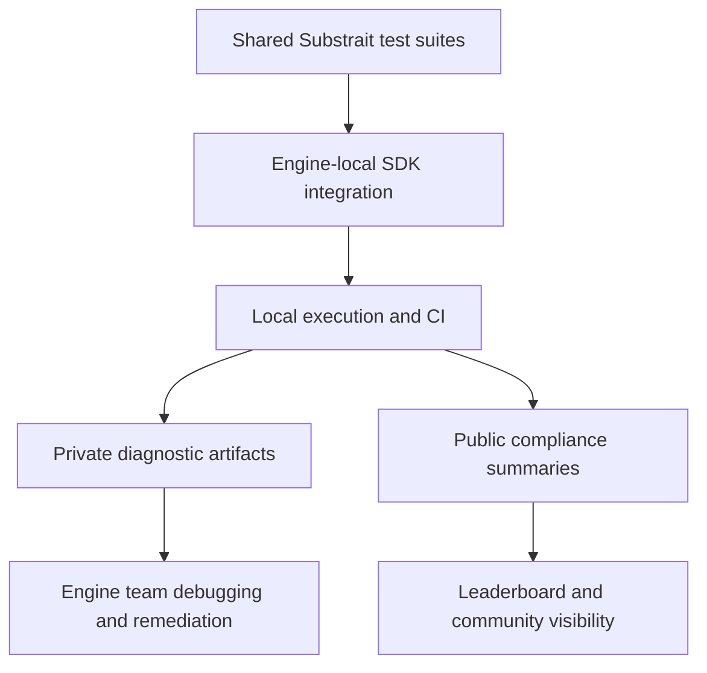

# Plan for a Workshop Paper on Decentralized Substrait Compliance

## Target Deliverable

A full workshop paper draft in Markdown, sized for roughly 6 to 8 pages, aimed at a systems and data workshop audience and written as a vision and methodology paper with academic references.

## Proposed Working Title

Decentralized Substrait Compliance: A Governance and Methodology Framework for Privacy-Preserving Interoperability Testing

## Paper Framing

This paper should be framed as a systems-oriented vision and methodology paper rather than a heavy empirical evaluation. Claims should be grounded in repository artifacts and public knowledge about Substrait, query plan portability, data interoperability, and decentralized validation practices. Quantitative claims should be conservative and derived only from repository materials unless independently verified.

## Core Thesis

A decentralized compliance architecture is a better fit for Substrait ecosystems than purely centralized certification because it preserves engine autonomy, enables privacy-aware sharing of results, supports heterogeneous implementation stacks, and still creates comparable community signals through standardized test suites, reporting formats, and optional public aggregation.

## Research Questions

1. How should a Substrait compliance framework be structured so independent engines can validate conformance without surrendering operational autonomy?
2. What governance and reporting mechanisms allow decentralized compliance evidence to remain comparable across engines?
3. How can privacy-preserving publication practices support community visibility without forcing disclosure of sensitive diagnostic artifacts?
4. What methodological choices are needed to make decentralized compliance testing credible, extensible, and useful for interoperability?

## Intended Contributions

1. A conceptual model of decentralized Substrait compliance built around shared tests, local execution, and standardized result publication.
2. A methodology for balancing private diagnostics with public compliance signals.
3. A governance-oriented discussion of interoperability, comparability, and ecosystem incentives.
4. A repository-grounded case study showing how SDKs, test suites, APIs, and leaderboard mechanisms can realize the model in practice.

## Evidence Available in the Repository

### Evidence supporting decentralization
- The framework is described as decentralized in [`docs/TECHNICAL_REPORT.md`](docs/TECHNICAL_REPORT.md).
- The project README describes a decentralized compliance testing framework with public reporting and CI integration in [`README.md`](README.md).
- SDK readmes position language-specific integrations for decentralized testing in [`sdk/python/README.md`](sdk/python/README.md) and [`sdk/rust/README.md`](sdk/rust/README.md).

### Evidence supporting governance and interoperability
- Shared test assets exist in [`test-suites/functions/README.md`](test-suites/functions/README.md) and TPC-H materials under [`test-suites/`](test-suites/).
- Integration points for engines and local execution are documented in [`INTEGRATION_GUIDE.md`](INTEGRATION_GUIDE.md).
- API-based aggregation and leaderboard patterns are documented in [`api/README.md`](api/README.md), [`docs/REST_API_SUMMARY.md`](docs/REST_API_SUMMARY.md), and [`docs/REST_API_PLAN.md`](docs/REST_API_PLAN.md).

### Evidence supporting privacy-aware publication
- The guide describes separate private and public report storage and anonymization in [`INTEGRATION_GUIDE.md`](INTEGRATION_GUIDE.md).
- Analytics and public leaderboard generation are referenced across demo and API documentation.

## Recommended Paper Structure

1. Abstract
2. Introduction
3. Background on Substrait and interoperability challenges
4. Why centralized compliance alone is insufficient
5. Decentralized compliance architecture
6. Governance and privacy model
7. Methodology for comparable compliance evidence
8. Repository-grounded case study
9. Discussion of limitations and threats to validity
10. Related work
11. Conclusion

## Section-by-Section Writing Plan

### 1. Abstract
State the problem, argue for decentralized compliance, summarize the architecture and methodology, and identify governance, privacy, and interoperability as the central themes.

### 2. Introduction
Motivate why cross-engine portability needs trustworthy compliance evidence. Explain why interoperability standards fail without practical validation. Introduce the tension between comparability and autonomy.

### 3. Background
Cover:
- What Substrait is and why portable query representations matter
- Why compliance is difficult across heterogeneous engines
- Why decentralized testing is attractive in open ecosystems

### 4. Limits of Centralized Certification
Explain likely drawbacks of purely centralized models:
- High operational bottlenecks
- Slow evolution with spec changes
- Limited privacy for engine-specific diagnostics
- Reduced participation incentives for implementers

### 5. Decentralized Compliance Architecture
Use repository-grounded components:
- Shared test suites
- Per-engine SDK integration
- Local or CI execution
- Optional centralized result submission
- Public leaderboard and analytics as lightweight coordination mechanisms

### 6. Governance and Privacy Model
Discuss:
- Shared artifact governance for test definitions
- Versioned reporting formats
- Private versus public result separation
- Anonymization and selective disclosure
- Community legitimacy through transparency of methodology rather than central authority alone

### 7. Methodology
Describe how credible decentralized compliance should work:
- Standardized suites and metadata
- Category-level and query-level reporting
- Handling unsupported features and partial implementations
- Reproducibility metadata
- Clear distinction between compliance evidence and performance benchmarking

### 8. Repository-Grounded Case Study
Use this project as an existence proof of the model:
- Language SDKs
- Function and TPC-H tests
- API submission and querying
- Leaderboard generation
- Demo and analytics pipeline
Keep the claims descriptive and architectural, not overstated.

### 9. Limitations and Threats to Validity
Include:
- Possible self-reporting bias
- Inconsistent execution environments
- Risk of gaming leaderboard metrics
- Evolving Substrait semantics
- Gaps between test passing and full semantic compatibility

### 10. Related Work
Likely buckets for references:
- Substrait specification and project materials
- SQL and data interoperability standards
- Database benchmarking and conformance testing
- Decentralized governance and federated validation
- Reproducibility and artifact evaluation in systems research

### 11. Conclusion
Reinforce that decentralized compliance is not the absence of rigor; it is a different governance and evidence model for interoperability ecosystems.

## Citation Strategy

The paper should include two citation layers:

### Layer 1: Primary domain references
- Substrait project or specification sources
- TPC-H benchmark source
- Relevant interoperability or query representation papers
- Standards or governance references where appropriate

### Layer 2: Systems and methodology references
- Reproducibility and artifact evaluation in systems research
- Interoperability testing and conformance assessment
- Privacy-preserving data sharing or selective disclosure where relevant

## Claim Discipline

To preserve rigor:
- Avoid claiming broad adoption unless externally verified.
- Avoid claiming measured superiority over centralized approaches unless supported by data.
- Use phrases such as suggests, enables, provides a framework for, and illustrates.
- Treat this repository as a design case and methodological prototype.

## Drafting Notes

### Tone
- Formal and academic
- Systems and data workshop style
- Analytical rather than promotional

### Figures to consider
1. A decentralized compliance workflow diagram
2. A governance split between shared artifacts, local execution, and public aggregation

### Optional Mermaid sketch

## Proposed Next Execution Steps

1. Create a Markdown paper file such as `docs/decentralized-substrait-compliance-paper.md`.
2. Draft the full paper with conservative, properly qualified claims.
3. Add a references section with real, relevant citations.
4. Revise for workshop style, coherence, and academic tone.
5. Optionally produce a shorter abstract-only version if needed for submission systems.

## Decision Point for Approval

This plan is ready for implementation as a full workshop paper draft in Markdown focused on decentralized governance, privacy, and interoperability, using the repository as a grounded case study and external references for rigor.