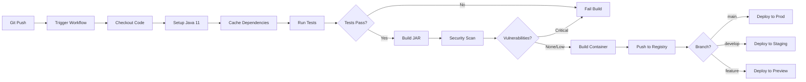

# Phase 10: CI/CD Integration Plan

## Overview

This document outlines the plan for implementing a complete CI/CD pipeline for the Substrait Compliance API, including automated testing, building, security scanning, and deployment.

---

## Goals

1. **Automated Testing** - Run tests on every commit and PR
2. **Container Building** - Build and publish container images
3. **Security Scanning** - Scan for vulnerabilities in code and dependencies
4. **Code Quality** - Enforce code quality standards
5. **Automated Deployment** - Deploy to staging/production environments
6. **Release Management** - Automate versioning and releases

---

## CI/CD Pipeline Architecture



---

## Workflow Structure

### 1. Pull Request Workflow
**Trigger**: On PR to main/develop branches  
**Purpose**: Validate changes before merge

**Steps**:
1. Checkout code
2. Setup Java 11
3. Cache Gradle dependencies
4. Run unit tests
5. Run integration tests
6. Generate test coverage report
7. Upload coverage to Codecov
8. Run security scan (Snyk/Trivy)
9. Run code quality checks (SonarQube)
10. Comment results on PR

### 2. Build and Test Workflow
**Trigger**: On push to any branch  
**Purpose**: Continuous validation

**Steps**:
1. Checkout code
2. Setup Java 11
3. Cache dependencies
4. Run linting (Checkstyle)
5. Run unit tests
6. Run integration tests
7. Generate coverage report
8. Archive test results
9. Upload artifacts

### 3. Container Build Workflow
**Trigger**: On push to main/develop, or manual  
**Purpose**: Build and publish container images

**Steps**:
1. Checkout code
2. Setup Buildx (multi-platform)
3. Login to container registry
4. Extract metadata (tags, labels)
5. Build container image
6. Run container security scan
7. Push to registry
8. Sign image (Cosign)
9. Generate SBOM

### 4. Deployment Workflow
**Trigger**: On successful container build, or manual  
**Purpose**: Deploy to target environment

**Steps**:
1. Download deployment artifacts
2. Setup kubectl/helm
3. Update deployment manifests
4. Apply to Kubernetes cluster
5. Wait for rollout
6. Run smoke tests
7. Notify team (Slack/Email)

### 5. Release Workflow
**Trigger**: On tag push (v*)  
**Purpose**: Create GitHub release

**Steps**:
1. Checkout code
2. Build release artifacts
3. Generate changelog
4. Create GitHub release
5. Upload artifacts
6. Publish to Maven Central (optional)
7. Update documentation

---

## GitHub Actions Workflows

### File Structure

```
.github/
├── workflows/
│   ├── pr-validation.yml       # PR checks
│   ├── build-test.yml          # Build and test
│   ├── container-build.yml     # Container image build
│   ├── deploy-staging.yml      # Deploy to staging
│   ├── deploy-production.yml   # Deploy to production
│   ├── release.yml             # Release management
│   └── security-scan.yml       # Security scanning
├── actions/
│   ├── setup-java/             # Reusable Java setup
│   └── deploy-k8s/             # Reusable K8s deployment
└── dependabot.yml              # Dependency updates
```

### Workflow: PR Validation

**File**: `.github/workflows/pr-validation.yml`

```yaml
name: PR Validation

on:
  pull_request:
    branches: [main, develop]
    paths:
      - 'api/**'
      - 'sdk/java/**'
      - '.github/workflows/pr-validation.yml'

jobs:
  validate:
    runs-on: ubuntu-latest
    
    steps:
      - name: Checkout code
        uses: actions/checkout@v4
        with:
          fetch-depth: 0  # Full history for SonarQube
      
      - name: Setup Java 11
        uses: actions/setup-java@v4
        with:
          java-version: '11'
          distribution: 'temurin'
          cache: 'gradle'
      
      - name: Grant execute permission
        run: chmod +x api/gradlew
      
      - name: Run tests
        run: |
          cd api
          ./gradlew test --no-daemon
      
      - name: Generate coverage report
        run: |
          cd api
          ./gradlew jacocoTestReport
      
      - name: Upload coverage to Codecov
        uses: codecov/codecov-action@v3
        with:
          files: ./api/build/reports/jacoco/test/jacocoTestReport.xml
          flags: api
          name: api-coverage
      
      - name: Run security scan
        uses: snyk/actions/gradle@master
        env:
          SNYK_TOKEN: ${{ secrets.SNYK_TOKEN }}
        with:
          args: --severity-threshold=high
      
      - name: SonarQube Scan
        uses: sonarsource/sonarqube-scan-action@master
        env:
          SONAR_TOKEN: ${{ secrets.SONAR_TOKEN }}
          SONAR_HOST_URL: ${{ secrets.SONAR_HOST_URL }}
      
      - name: Comment PR
        uses: actions/github-script@v7
        if: always()
        with:
          script: |
            const coverage = '85%';  // Parse from report
            github.rest.issues.createComment({
              issue_number: context.issue.number,
              owner: context.repo.owner,
              repo: context.repo.repo,
              body: `## Test Results\n✅ All tests passed\n📊 Coverage: ${coverage}`
            })
```

### Workflow: Container Build

**File**: `.github/workflows/container-build.yml`

```yaml
name: Container Build

on:
  push:
    branches: [main, develop]
    paths:
      - 'api/**'
      - 'sdk/java/**'
  workflow_dispatch:

env:
  REGISTRY: ghcr.io
  IMAGE_NAME: ${{ github.repository }}/substrait-compliance-api

jobs:
  build:
    runs-on: ubuntu-latest
    permissions:
      contents: read
      packages: write
      id-token: write  # For Cosign
    
    steps:
      - name: Checkout code
        uses: actions/checkout@v4
      
      - name: Setup Docker Buildx
        uses: docker/setup-buildx-action@v3
      
      - name: Login to GitHub Container Registry
        uses: docker/login-action@v3
        with:
          registry: ${{ env.REGISTRY }}
          username: ${{ github.actor }}
          password: ${{ secrets.GITHUB_TOKEN }}
      
      - name: Extract metadata
        id: meta
        uses: docker/metadata-action@v5
        with:
          images: ${{ env.REGISTRY }}/${{ env.IMAGE_NAME }}
          tags: |
            type=ref,event=branch
            type=ref,event=pr
            type=semver,pattern={{version}}
            type=semver,pattern={{major}}.{{minor}}
            type=sha,prefix={{branch}}-
      
      - name: Build and push
        uses: docker/build-push-action@v5
        with:
          context: .
          file: ./api/Containerfile
          push: true
          tags: ${{ steps.meta.outputs.tags }}
          labels: ${{ steps.meta.outputs.labels }}
          cache-from: type=gha
          cache-to: type=gha,mode=max
          platforms: linux/amd64,linux/arm64
      
      - name: Run Trivy security scan
        uses: aquasecurity/trivy-action@master
        with:
          image-ref: ${{ env.REGISTRY }}/${{ env.IMAGE_NAME }}:${{ github.sha }}
          format: 'sarif'
          output: 'trivy-results.sarif'
      
      - name: Upload Trivy results
        uses: github/codeql-action/upload-sarif@v3
        with:
          sarif_file: 'trivy-results.sarif'
      
      - name: Install Cosign
        uses: sigstore/cosign-installer@v3
      
      - name: Sign container image
        run: |
          cosign sign --yes \
            ${{ env.REGISTRY }}/${{ env.IMAGE_NAME }}@${{ steps.build.outputs.digest }}
      
      - name: Generate SBOM
        uses: anchore/sbom-action@v0
        with:
          image: ${{ env.REGISTRY }}/${{ env.IMAGE_NAME }}:${{ github.sha }}
          format: spdx-json
          output-file: sbom.spdx.json
      
      - name: Upload SBOM
        uses: actions/upload-artifact@v4
        with:
          name: sbom
          path: sbom.spdx.json
```

### Workflow: Deploy to Staging

**File**: `.github/workflows/deploy-staging.yml`

```yaml
name: Deploy to Staging

on:
  workflow_run:
    workflows: ["Container Build"]
    types: [completed]
    branches: [develop]
  workflow_dispatch:

env:
  KUBE_NAMESPACE: substrait-staging
  DEPLOYMENT_NAME: substrait-api

jobs:
  deploy:
    runs-on: ubuntu-latest
    if: ${{ github.event.workflow_run.conclusion == 'success' }}
    environment:
      name: staging
      url: https://api-staging.substrait.io
    
    steps:
      - name: Checkout code
        uses: actions/checkout@v4
      
      - name: Setup kubectl
        uses: azure/setup-kubectl@v3
        with:
          version: 'v1.28.0'
      
      - name: Configure kubectl
        run: |
          echo "${{ secrets.KUBE_CONFIG_STAGING }}" | base64 -d > kubeconfig
          export KUBECONFIG=kubeconfig
      
      - name: Update deployment
        run: |
          kubectl set image deployment/${{ env.DEPLOYMENT_NAME }} \
            api=ghcr.io/${{ github.repository }}/substrait-compliance-api:develop \
            -n ${{ env.KUBE_NAMESPACE }}
      
      - name: Wait for rollout
        run: |
          kubectl rollout status deployment/${{ env.DEPLOYMENT_NAME }} \
            -n ${{ env.KUBE_NAMESPACE }} \
            --timeout=5m
      
      - name: Run smoke tests
        run: |
          ENDPOINT="https://api-staging.substrait.io"
          curl -f $ENDPOINT/actuator/health || exit 1
          echo "✅ Smoke tests passed"
      
      - name: Notify Slack
        uses: slackapi/slack-github-action@v1
        with:
          payload: |
            {
              "text": "🚀 Deployed to Staging",
              "blocks": [
                {
                  "type": "section",
                  "text": {
                    "type": "mrkdwn",
                    "text": "Deployment to *staging* completed\n*Commit:* ${{ github.sha }}\n*URL:* https://api-staging.substrait.io"
                  }
                }
              ]
            }
        env:
          SLACK_WEBHOOK_URL: ${{ secrets.SLACK_WEBHOOK_URL }}
```

### Workflow: Deploy to Production

**File**: `.github/workflows/deploy-production.yml`

```yaml
name: Deploy to Production

on:
  workflow_dispatch:
    inputs:
      version:
        description: 'Version to deploy (e.g., v1.0.0)'
        required: true
        type: string

env:
  KUBE_NAMESPACE: substrait-production
  DEPLOYMENT_NAME: substrait-api

jobs:
  deploy:
    runs-on: ubuntu-latest
    environment:
      name: production
      url: https://api.substrait.io
    
    steps:
      - name: Checkout code
        uses: actions/checkout@v4
        with:
          ref: ${{ inputs.version }}
      
      - name: Setup kubectl
        uses: azure/setup-kubectl@v3
      
      - name: Configure kubectl
        run: |
          echo "${{ secrets.KUBE_CONFIG_PROD }}" | base64 -d > kubeconfig
          export KUBECONFIG=kubeconfig
      
      - name: Create backup
        run: |
          kubectl get deployment ${{ env.DEPLOYMENT_NAME }} \
            -n ${{ env.KUBE_NAMESPACE }} \
            -o yaml > deployment-backup.yaml
      
      - name: Update deployment
        run: |
          kubectl set image deployment/${{ env.DEPLOYMENT_NAME }} \
            api=ghcr.io/${{ github.repository }}/substrait-compliance-api:${{ inputs.version }} \
            -n ${{ env.KUBE_NAMESPACE }}
      
      - name: Wait for rollout
        run: |
          kubectl rollout status deployment/${{ env.DEPLOYMENT_NAME }} \
            -n ${{ env.KUBE_NAMESPACE }} \
            --timeout=10m
      
      - name: Run smoke tests
        run: |
          ENDPOINT="https://api.substrait.io"
          
          # Health check
          curl -f $ENDPOINT/actuator/health || exit 1
          
          # API endpoint check
          curl -f $ENDPOINT/api/v1/reports?page=0&size=1 \
            -H "Authorization: Bearer ${{ secrets.API_TEST_TOKEN }}" || exit 1
          
          echo "✅ All smoke tests passed"
      
      - name: Rollback on failure
        if: failure()
        run: |
          kubectl apply -f deployment-backup.yaml
          kubectl rollout status deployment/${{ env.DEPLOYMENT_NAME }} \
            -n ${{ env.KUBE_NAMESPACE }}
      
      - name: Notify team
        uses: slackapi/slack-github-action@v1
        if: always()
        with:
          payload: |
            {
              "text": "${{ job.status == 'success' && '✅' || '❌' }} Production Deployment",
              "blocks": [
                {
                  "type": "section",
                  "text": {
                    "type": "mrkdwn",
                    "text": "Production deployment *${{ job.status }}*\n*Version:* ${{ inputs.version }}\n*URL:* https://api.substrait.io"
                  }
                }
              ]
            }
        env:
          SLACK_WEBHOOK_URL: ${{ secrets.SLACK_WEBHOOK_URL }}
```

---

## Security Scanning

### 1. Dependency Scanning (Snyk)

```yaml
- name: Run Snyk security scan
  uses: snyk/actions/gradle@master
  env:
    SNYK_TOKEN: ${{ secrets.SNYK_TOKEN }}
  with:
    args: --severity-threshold=high --fail-on=upgradable
```

### 2. Container Scanning (Trivy)

```yaml
- name: Run Trivy vulnerability scanner
  uses: aquasecurity/trivy-action@master
  with:
    image-ref: 'substrait-compliance-api:latest'
    format: 'sarif'
    output: 'trivy-results.sarif'
    severity: 'CRITICAL,HIGH'
```

### 3. Code Scanning (CodeQL)

```yaml
- name: Initialize CodeQL
  uses: github/codeql-action/init@v3
  with:
    languages: java

- name: Perform CodeQL Analysis
  uses: github/codeql-action/analyze@v3
```

### 4. Secret Scanning (GitGuardian)

```yaml
- name: GitGuardian scan
  uses: GitGuardian/ggshield-action@v1
  env:
    GITHUB_PUSH_BEFORE_SHA: ${{ github.event.before }}
    GITHUB_PUSH_BASE_SHA: ${{ github.event.base }}
    GITHUB_DEFAULT_BRANCH: ${{ github.event.repository.default_branch }}
    GITGUARDIAN_API_KEY: ${{ secrets.GITGUARDIAN_API_KEY }}
```

---

## Code Quality Checks

### 1. SonarQube Integration

```yaml
- name: SonarQube Scan
  uses: sonarsource/sonarqube-scan-action@master
  env:
    SONAR_TOKEN: ${{ secrets.SONAR_TOKEN }}
    SONAR_HOST_URL: ${{ secrets.SONAR_HOST_URL }}
  with:
    args: >
      -Dsonar.projectKey=substrait-compliance-api
      -Dsonar.java.binaries=api/build/classes
      -Dsonar.coverage.jacoco.xmlReportPaths=api/build/reports/jacoco/test/jacocoTestReport.xml
```

### 2. Checkstyle

```yaml
- name: Run Checkstyle
  run: |
    cd api
    ./gradlew checkstyleMain checkstyleTest
```

### 3. SpotBugs

```yaml
- name: Run SpotBugs
  run: |
    cd api
    ./gradlew spotbugsMain
```

---

## Secrets Management

### Required Secrets

| Secret Name | Description | Used In |
|-------------|-------------|---------|
| `GITHUB_TOKEN` | GitHub API token | All workflows |
| `SNYK_TOKEN` | Snyk API token | Security scanning |
| `SONAR_TOKEN` | SonarQube token | Code quality |
| `SONAR_HOST_URL` | SonarQube URL | Code quality |
| `KUBE_CONFIG_STAGING` | Kubernetes config (staging) | Staging deployment |
| `KUBE_CONFIG_PROD` | Kubernetes config (production) | Production deployment |
| `SLACK_WEBHOOK_URL` | Slack webhook | Notifications |
| `API_TEST_TOKEN` | API test token | Smoke tests |
| `GITGUARDIAN_API_KEY` | GitGuardian token | Secret scanning |
| `CODECOV_TOKEN` | Codecov token | Coverage reporting |

### Setting Secrets

```bash
# GitHub CLI
gh secret set SNYK_TOKEN --body "your-token"
gh secret set SONAR_TOKEN --body "your-token"

# Or via GitHub UI
# Settings > Secrets and variables > Actions > New repository secret
```

---

## Environments

### Staging Environment

**Configuration**:
- **Name**: staging
- **URL**: https://api-staging.substrait.io
- **Protection**: None (auto-deploy on develop)
- **Secrets**: KUBE_CONFIG_STAGING

### Production Environment

**Configuration**:
- **Name**: production
- **URL**: https://api.substrait.io
- **Protection**: Required reviewers (2)
- **Secrets**: KUBE_CONFIG_PROD
- **Deployment**: Manual approval required

---

## Monitoring & Observability

### 1. Deployment Tracking

```yaml
- name: Track deployment
  uses: chrnorm/deployment-action@v2
  with:
    token: ${{ secrets.GITHUB_TOKEN }}
    environment: production
    description: 'Deploying version ${{ inputs.version }}'
```

### 2. Performance Monitoring

```yaml
- name: Run performance tests
  run: |
    # Use k6 or similar
    k6 run performance-tests.js
```

### 3. Log Aggregation

- **Tool**: Datadog / New Relic / ELK Stack
- **Integration**: Via agent in Kubernetes
- **Alerts**: Configure for errors, high latency

---

## Release Management

### Semantic Versioning

- **Major**: Breaking changes (v2.0.0)
- **Minor**: New features (v1.1.0)
- **Patch**: Bug fixes (v1.0.1)

### Release Process

1. Create release branch: `release/v1.0.0`
2. Update version in `build.gradle`
3. Update CHANGELOG.md
4. Create PR to main
5. After merge, tag: `git tag v1.0.0`
6. Push tag: `git push origin v1.0.0`
7. GitHub Action creates release
8. Deploy to production

### Automated Changelog

```yaml
- name: Generate changelog
  uses: mikepenz/release-changelog-builder-action@v4
  with:
    configuration: ".github/changelog-config.json"
  env:
    GITHUB_TOKEN: ${{ secrets.GITHUB_TOKEN }}
```

---

## Rollback Strategy

### Automatic Rollback

```yaml
- name: Rollback on failure
  if: failure()
  run: |
    kubectl rollout undo deployment/${{ env.DEPLOYMENT_NAME }} \
      -n ${{ env.KUBE_NAMESPACE }}
```

### Manual Rollback

```bash
# List rollout history
kubectl rollout history deployment/substrait-api -n production

# Rollback to previous version
kubectl rollout undo deployment/substrait-api -n production

# Rollback to specific revision
kubectl rollout undo deployment/substrait-api -n production --to-revision=3
```

---

## Cost Optimization

### 1. Cache Dependencies

```yaml
- name: Cache Gradle packages
  uses: actions/cache@v3
  with:
    path: |
      ~/.gradle/caches
      ~/.gradle/wrapper
    key: ${{ runner.os }}-gradle-${{ hashFiles('**/*.gradle*', '**/gradle-wrapper.properties') }}
    restore-keys: |
      ${{ runner.os }}-gradle-
```

### 2. Conditional Workflows

```yaml
on:
  push:
    paths:
      - 'api/**'
      - 'sdk/java/**'
  # Only run on relevant changes
```

### 3. Concurrent Jobs

```yaml
jobs:
  test:
    strategy:
      matrix:
        java: [11, 17]
    # Run tests in parallel
```

---

## Implementation Checklist

### Phase 1: Setup (Week 1)
- [ ] Create `.github/workflows/` directory
- [ ] Configure repository secrets
- [ ] Set up environments (staging, production)
- [ ] Configure branch protection rules
- [ ] Set up Snyk account
- [ ] Set up SonarQube instance
- [ ] Configure Codecov

### Phase 2: Basic CI (Week 1-2)
- [ ] Implement PR validation workflow
- [ ] Implement build and test workflow
- [ ] Add test coverage reporting
- [ ] Add Checkstyle/SpotBugs
- [ ] Test workflows on feature branch

### Phase 3: Container Build (Week 2)
- [ ] Implement container build workflow
- [ ] Configure GitHub Container Registry
- [ ] Add Trivy security scanning
- [ ] Implement image signing with Cosign
- [ ] Generate and upload SBOM

### Phase 4: Security (Week 2-3)
- [ ] Implement Snyk scanning
- [ ] Implement CodeQL analysis
- [ ] Add secret scanning
- [ ] Configure security alerts
- [ ] Set up vulnerability management

### Phase 5: Deployment (Week 3-4)
- [ ] Set up Kubernetes clusters (staging, prod)
- [ ] Implement staging deployment workflow
- [ ] Implement production deployment workflow
- [ ] Add smoke tests
- [ ] Configure rollback mechanism

### Phase 6: Monitoring (Week 4)
- [ ] Set up deployment tracking
- [ ] Configure Slack notifications
- [ ] Add performance monitoring
- [ ] Set up log aggregation
- [ ] Create dashboards

### Phase 7: Release Management (Week 4)
- [ ] Implement release workflow
- [ ] Configure automated changelog
- [ ] Set up semantic versioning
- [ ] Document release process
- [ ] Test end-to-end release

---

## Success Metrics

### CI/CD Performance
- **Build Time**: < 10 minutes
- **Test Execution**: < 5 minutes
- **Deployment Time**: < 3 minutes
- **Pipeline Success Rate**: > 95%

### Quality Metrics
- **Test Coverage**: > 80%
- **Code Quality Gate**: Pass
- **Security Vulnerabilities**: 0 critical/high
- **Build Failures**: < 5%

### Deployment Metrics
- **Deployment Frequency**: Multiple per day
- **Lead Time**: < 1 hour
- **MTTR**: < 30 minutes
- **Change Failure Rate**: < 5%

---

## Documentation

### Required Documentation
1. **CI/CD Guide** - How to use the pipelines
2. **Deployment Runbook** - Step-by-step deployment
3. **Rollback Procedures** - How to rollback
4. **Troubleshooting Guide** - Common issues
5. **Security Policies** - Security requirements

---

## Conclusion

This CI/CD plan provides a comprehensive, production-ready pipeline for the Substrait Compliance API with:

- **Automated Testing** - Unit, integration, and smoke tests
- **Security First** - Multiple scanning tools and image signing
- **Quality Gates** - Code quality and coverage enforcement
- **Safe Deployments** - Staging validation and production approval
- **Observability** - Monitoring, logging, and alerting
- **Rollback Safety** - Automatic and manual rollback options

**Estimated Implementation Time**: 4 weeks  
**Maintenance Effort**: 2-4 hours/week  
**Cost**: ~$50-100/month (GitHub Actions, scanning tools)

---

*Last Updated: 2026-04-16*
*Status: Planning Complete - Ready for Implementation*