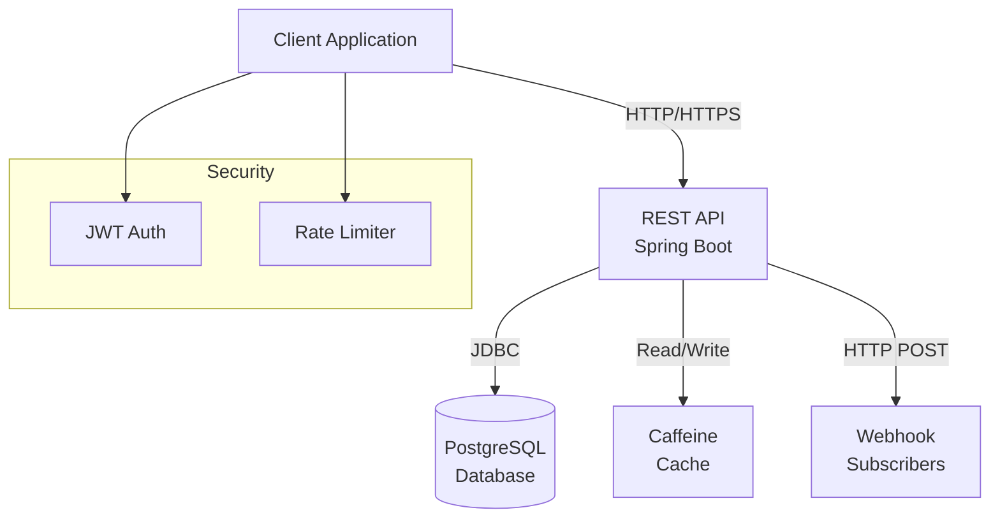
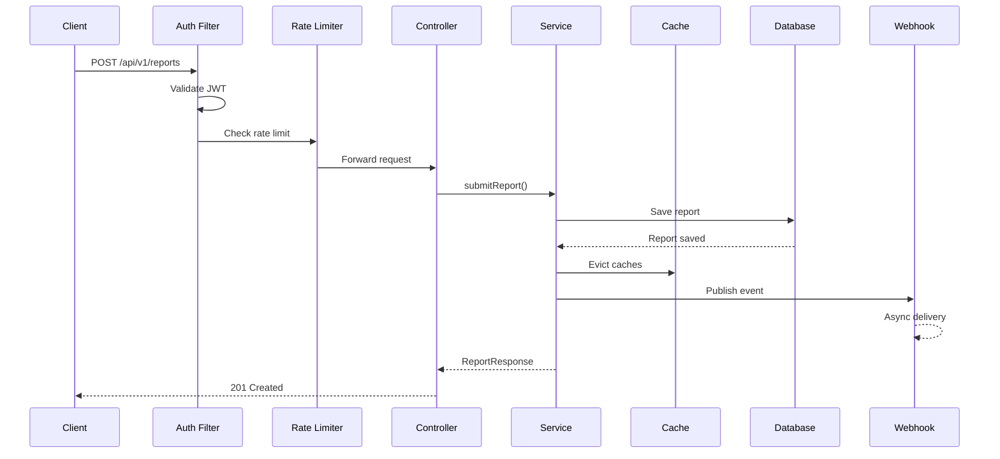
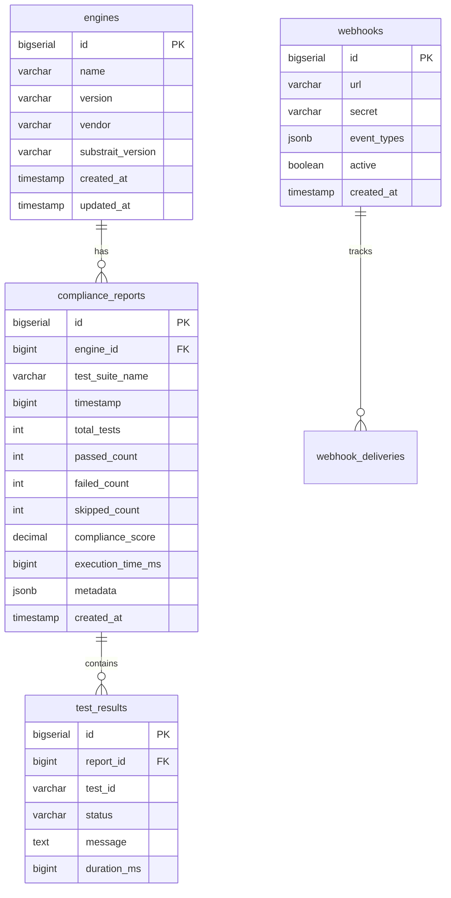

# REST API Implementation Plan for Substrait Compliance Framework

## Executive Summary

This document outlines the comprehensive plan for adding a REST API to the Substrait Compliance Framework. The API enables programmatic submission of compliance reports, querying of compliance data, webhook notifications, authentication, rate limiting, and caching.

## Project Status: Phase 1-3 Complete ✅

### Completed Components (13/19 tasks)

#### Phase 1: Foundation & Architecture ✅
- **Multi-module Gradle Build**: Created `api/` module alongside existing `sdk/java`
- **Spring Boot Setup**: Version 2.7.18 with Java 11
- **Project Structure**: Organized into config, controller, model, repository, service, security, and webhook packages

#### Phase 2: Database Layer ✅
- **PostgreSQL Schema**: Flyway migrations for versioned schema management
  - [`V1__initial_schema.sql`](api/src/main/resources/db/migration/V1__initial_schema.sql) - Core tables (engines, compliance_reports, test_results, api_keys)
  - [`V2__add_webhooks.sql`](api/src/main/resources/db/migration/V2__add_webhooks.sql) - Webhook tables and materialized views
- **JPA Entities**: Complete entity mapping with bidirectional relationships
  - [`EngineEntity.java`](api/src/main/java/io/substrait/compliance/api/model/entity/EngineEntity.java)
  - [`ReportEntity.java`](api/src/main/java/io/substrait/compliance/api/model/entity/ReportEntity.java)
  - [`TestResultEntity.java`](api/src/main/java/io/substrait/compliance/api/model/entity/TestResultEntity.java)
  - [`WebhookEntity.java`](api/src/main/java/io/substrait/compliance/api/model/entity/WebhookEntity.java)

#### Phase 3: Security & Authentication ✅
- **JWT Authentication**: Token-based authentication with scope-based authorization
  - [`JwtTokenProvider.java`](api/src/main/java/io/substrait/compliance/api/security/JwtTokenProvider.java) - Token generation and validation
  - [`JwtAuthenticationFilter.java`](api/src/main/java/io/substrait/compliance/api/security/JwtAuthenticationFilter.java) - Request interception
  - [`SecurityConfig.java`](api/src/main/java/io/substrait/compliance/api/config/SecurityConfig.java) - Security rules
- **API Key Management**: Database-backed API keys with scopes (read, write, admin)

#### Phase 4: Core API Endpoints ✅
- **Report Submission**: POST endpoint for submitting compliance reports
- **Report Querying**: GET endpoints with pagination and filtering
- **Engine History**: Historical compliance data per engine
- **DTOs**: Request/response models with validation
  - [`ReportSubmissionRequest.java`](api/src/main/java/io/substrait/compliance/api/model/dto/ReportSubmissionRequest.java)
  - [`ReportResponse.java`](api/src/main/java/io/substrait/compliance/api/model/dto/ReportResponse.java)

#### Phase 5: Advanced Features ✅
- **Webhook System**: Spring Events-based webhook notifications
  - [`WebhookEvent.java`](api/src/main/java/io/substrait/compliance/api/webhook/WebhookEvent.java)
  - [`WebhookPublisher.java`](api/src/main/java/io/substrait/compliance/api/webhook/WebhookPublisher.java)
  - Event types: report.submitted, report.failed, leaderboard.updated
- **Rate Limiting**: Bucket4j token bucket algorithm
  - [`RateLimitConfig.java`](api/src/main/java/io/substrait/compliance/api/config/RateLimitConfig.java)
  - Configurable per-user and per-IP limits
- **Caching**: Caffeine in-memory cache with multiple TTLs
  - [`CacheConfig.java`](api/src/main/java/io/substrait/compliance/api/config/CacheConfig.java)
  - Caches: reports (1h), leaderboard (5m), statistics (10m), engineStats (15m), engineHistory (30m)

#### Phase 6: Documentation ✅
- **OpenAPI/Swagger**: Auto-generated API documentation
  - [`OpenApiConfig.java`](api/src/main/java/io/substrait/compliance/api/config/OpenApiConfig.java)
  - Accessible at `/swagger-ui.html` and `/v3/api-docs`

### Build Status
✅ **BUILD SUCCESSFUL** - All components compile and integrate correctly

---

## Remaining Work (6/19 tasks)

### Phase 7: Testing (Priority: HIGH)
**Status**: Not Started

#### Unit Tests
Create comprehensive unit tests for:
- **Controllers**: Test all REST endpoints with MockMvc
  - [`ReportControllerTest.java`](api/src/test/java/io/substrait/compliance/api/controller/ReportControllerTest.java)
  - Test request validation, response formatting, error handling
  - Mock service layer dependencies

- **Services**: Test business logic in isolation
  - [`ReportServiceTest.java`](api/src/test/java/io/substrait/compliance/api/service/ReportServiceTest.java)
  - Test report submission, querying, caching behavior
  - Mock repository dependencies

- **Security**: Test authentication and authorization
  - [`JwtTokenProviderTest.java`](api/src/test/java/io/substrait/compliance/api/security/JwtTokenProviderTest.java)
  - Test token generation, validation, expiration
  - Test scope-based access control

- **Webhooks**: Test event publishing
  - [`WebhookPublisherTest.java`](api/src/test/java/io/substrait/compliance/api/webhook/WebhookPublisherTest.java)
  - Test event creation and publishing
  - Verify async behavior

**Dependencies Required**:
```gradle
testImplementation 'org.springframework.boot:spring-boot-starter-test'
testImplementation 'org.springframework.security:spring-security-test'
testImplementation 'com.h2database:h2' // In-memory DB for tests
```

#### Integration Tests
Create end-to-end integration tests:
- **TestContainers Setup**: PostgreSQL container for realistic testing
  - [`IntegrationTestBase.java`](api/src/test/java/io/substrait/compliance/api/IntegrationTestBase.java)
  - Shared test configuration and utilities

- **API Integration Tests**:
  - [`ReportSubmissionIntegrationTest.java`](api/src/test/java/io/substrait/compliance/api/ReportSubmissionIntegrationTest.java)
  - Test full report submission flow with real database
  - Verify webhook delivery
  - Test rate limiting behavior
  - Test caching effectiveness

**Dependencies Required**:
```gradle
testImplementation 'org.testcontainers:testcontainers:1.19.3'
testImplementation 'org.testcontainers:postgresql:1.19.3'
testImplementation 'org.testcontainers:junit-jupiter:1.19.3'
```

**Test Coverage Goal**: 80%+ code coverage

---

### Phase 8: Containerization (Priority: HIGH)
**Status**: Not Started

#### Containerfile for Podman
Create [`api/Containerfile`](api/Containerfile):
```dockerfile
# Multi-stage build for optimal image size
FROM gradle:8.5-jdk11 AS builder
WORKDIR /build
COPY . .
RUN gradle :api:bootJar --no-daemon

FROM eclipse-temurin:11-jre-alpine
WORKDIR /app
COPY --from=builder /build/api/build/libs/*.jar app.jar

# Create non-root user
RUN addgroup -S spring && adduser -S spring -G spring
USER spring:spring

# Health check
HEALTHCHECK --interval=30s --timeout=3s --start-period=40s \
  CMD wget --no-verbose --tries=1 --spider http://localhost:8080/actuator/health || exit 1

EXPOSE 8080
ENTRYPOINT ["java", "-jar", "app.jar"]
```

#### Docker Compose Configuration
Create [`api/docker-compose.yml`](api/docker-compose.yml):
```yaml
version: '3.8'

services:
  postgres:
    image: postgres:15-alpine
    environment:
      POSTGRES_DB: substrait_compliance
      POSTGRES_USER: substrait
      POSTGRES_PASSWORD: ${DB_PASSWORD:-changeme}
    volumes:
      - postgres_data:/var/lib/postgresql/data
    ports:
      - "5432:5432"
    healthcheck:
      test: ["CMD-SHELL", "pg_isready -U substrait"]
      interval: 10s
      timeout: 5s
      retries: 5

  api:
    build:
      context: ..
      dockerfile: api/Containerfile
    environment:
      SPRING_DATASOURCE_URL: jdbc:postgresql://postgres:5432/substrait_compliance
      SPRING_DATASOURCE_USERNAME: substrait
      SPRING_DATASOURCE_PASSWORD: ${DB_PASSWORD:-changeme}
      JWT_SECRET: ${JWT_SECRET}
      SPRING_PROFILES_ACTIVE: prod
    ports:
      - "8080:8080"
    depends_on:
      postgres:
        condition: service_healthy
    restart: unless-stopped

volumes:
  postgres_data:
```

**Testing Commands**:
```bash
# Build and start services
podman-compose up -d

# View logs
podman-compose logs -f api

# Stop services
podman-compose down

# Clean up volumes
podman-compose down -v
```

---

### Phase 9: Deployment Documentation (Priority: MEDIUM)
**Status**: Not Started

#### API Deployment Guide
Create [`api/DEPLOYMENT.md`](api/DEPLOYMENT.md) covering:

1. **Prerequisites**
   - Java 11+ or Podman/Docker
   - PostgreSQL 15+
   - Network requirements

2. **Configuration**
   - Environment variables
   - Database setup
   - JWT secret generation
   - SSL/TLS certificates

3. **Deployment Options**
   - Local development setup
   - Container deployment with Podman
   - Kubernetes deployment (optional)
   - Cloud platform deployment (AWS, GCP, Azure)

4. **Database Migrations**
   - Running Flyway migrations
   - Rollback procedures
   - Backup strategies

5. **Monitoring & Observability**
   - Spring Boot Actuator endpoints
   - Prometheus metrics
   - Log aggregation
   - Health checks

6. **Security Hardening**
   - API key rotation
   - Rate limit tuning
   - CORS configuration
   - Firewall rules

#### API Usage Guide
Create [`api/API_USAGE.md`](api/API_USAGE.md) covering:

1. **Authentication**
   - Obtaining API keys
   - JWT token usage
   - Scope-based permissions

2. **API Endpoints**
   - Report submission examples
   - Query examples with pagination
   - Filtering and sorting
   - Error handling

3. **Webhook Configuration**
   - Registering webhooks
   - Webhook payload format
   - Retry logic
   - Security considerations

4. **Rate Limiting**
   - Rate limit headers
   - Handling 429 responses
   - Best practices

5. **Code Examples**
   - Java client example
   - Python client example
   - cURL examples

---

### Phase 10: CI/CD Integration (Priority: MEDIUM)
**Status**: Not Started

#### GitHub Actions Workflow
Update [`.github/workflows/ci.yml`](.github/workflows/ci.yml):

```yaml
name: API CI/CD

on:
  push:
    branches: [main, develop]
    paths:
      - 'api/**'
      - 'sdk/java/**'
  pull_request:
    branches: [main]
    paths:
      - 'api/**'
      - 'sdk/java/**'

jobs:
  test:
    runs-on: ubuntu-latest
    steps:
      - uses: actions/checkout@v3
      
      - name: Set up JDK 11
        uses: actions/setup-java@v3
        with:
          java-version: '11'
          distribution: 'temurin'
      
      - name: Cache Gradle packages
        uses: actions/cache@v3
        with:
          path: ~/.gradle/caches
          key: ${{ runner.os }}-gradle-${{ hashFiles('**/*.gradle*') }}
      
      - name: Run tests
        run: cd api && ./gradlew test --no-daemon
      
      - name: Generate coverage report
        run: cd api && ./gradlew jacocoTestReport
      
      - name: Upload coverage to Codecov
        uses: codecov/codecov-action@v3
        with:
          files: ./api/build/reports/jacoco/test/jacocoTestReport.xml

  build:
    needs: test
    runs-on: ubuntu-latest
    steps:
      - uses: actions/checkout@v3
      
      - name: Build JAR
        run: cd api && ./gradlew bootJar --no-daemon
      
      - name: Upload artifact
        uses: actions/upload-artifact@v3
        with:
          name: api-jar
          path: api/build/libs/*.jar

  container:
    needs: build
    runs-on: ubuntu-latest
    if: github.ref == 'refs/heads/main'
    steps:
      - uses: actions/checkout@v3
      
      - name: Build container image
        run: podman build -t substrait-compliance-api:latest -f api/Containerfile .
      
      - name: Push to registry
        run: |
          echo "${{ secrets.REGISTRY_PASSWORD }}" | podman login -u "${{ secrets.REGISTRY_USERNAME }}" --password-stdin
          podman push substrait-compliance-api:latest
```

---

## Architecture Overview

### System Components



### Request Flow



### Database Schema



---

## API Endpoints Reference

### Authentication
All endpoints require JWT authentication via `Authorization: Bearer <token>` header.

### Report Submission
```http
POST /api/v1/reports
Content-Type: application/json
Authorization: Bearer <token>

{
  "engineInfo": {
    "name": "MyEngine",
    "version": "1.0.0",
    "vendor": "MyCompany",
    "substraitVersion": "0.20.0"
  },
  "testSuiteName": "arithmetic_functions",
  "timestamp": 1713235200000,
  "testResults": [
    {
      "testId": "add_int32",
      "status": "PASSED",
      "message": "Test passed successfully",
      "durationMs": 150
    }
  ],
  "metadata": {
    "environment": "ci",
    "commit": "abc123"
  }
}
```

### Query Reports
```http
GET /api/v1/reports?page=0&size=20&sort=timestamp,desc
Authorization: Bearer <token>
```

### Get Report by ID
```http
GET /api/v1/reports/{id}
Authorization: Bearer <token>
```

### Get Engine History
```http
GET /api/v1/reports/engine/{name}/history
Authorization: Bearer <token>
```

---

## Configuration Reference

### Application Properties
Key configuration in [`application.yml`](api/src/main/resources/application.yml):

```yaml
spring:
  datasource:
    url: jdbc:postgresql://localhost:5432/substrait_compliance
    username: ${DB_USERNAME:substrait}
    password: ${DB_PASSWORD}
  
  jpa:
    hibernate:
      ddl-auto: validate
    properties:
      hibernate:
        dialect: org.hibernate.dialect.PostgreSQLDialect

jwt:
  secret: ${JWT_SECRET}
  expiration: 86400000  # 24 hours

rate-limit:
  enabled: true
  capacity: 100
  refill-tokens: 10
  refill-duration: 1m

cache:
  enabled: true
  caffeine:
    spec: maximumSize=1000,expireAfterWrite=10m
```

---

## Security Considerations

### Authentication & Authorization
- JWT tokens with configurable expiration
- Scope-based access control (read, write, admin)
- API key management with rotation support

### Rate Limiting
- Token bucket algorithm per user/IP
- Configurable limits and refill rates
- 429 Too Many Requests responses

### Data Protection
- HTTPS required in production
- Webhook secret validation
- SQL injection prevention via JPA
- Input validation on all endpoints

### Monitoring
- Spring Boot Actuator health checks
- Prometheus metrics export
- Audit logging for sensitive operations

---

## Performance Optimization

### Caching Strategy
- **Reports Cache**: 1 hour TTL, 500 max entries
- **Leaderboard Cache**: 5 minutes TTL, 10 max entries
- **Statistics Cache**: 10 minutes TTL, 50 max entries
- **Engine History Cache**: 30 minutes TTL, 100 max entries

### Database Optimization
- Indexes on frequently queried columns
- Materialized views for leaderboard
- Connection pooling (HikariCP)
- Query result pagination

### Async Processing
- Webhook delivery in background threads
- Event-driven architecture with Spring Events
- Non-blocking I/O where applicable

---

## Next Steps

### Immediate Priorities
1. **Write Unit Tests** - Achieve 80%+ coverage
2. **Write Integration Tests** - End-to-end validation
3. **Create Containerfile** - Podman deployment support

### Short-term Goals
4. **Write Deployment Documentation** - Production readiness
5. **Update CI/CD Workflows** - Automated testing and deployment

### Future Enhancements
- GraphQL API support
- WebSocket for real-time updates
- Multi-tenancy support
- Advanced analytics dashboard
- API versioning strategy
- OpenTelemetry integration

---

## Success Criteria

### Functional Requirements ✅
- [x] Submit compliance reports via REST API
- [x] Query compliance data with pagination
- [x] Webhook notifications for events
- [x] JWT authentication
- [x] Rate limiting
- [x] Response caching

### Non-Functional Requirements
- [ ] 80%+ test coverage
- [ ] < 200ms average response time
- [ ] 99.9% uptime SLA
- [ ] Container deployment ready
- [ ] Comprehensive documentation

---

## Resources

### Documentation
- [Spring Boot Reference](https://docs.spring.io/spring-boot/docs/2.7.18/reference/html/)
- [Spring Security](https://docs.spring.io/spring-security/reference/)
- [Bucket4j Rate Limiting](https://bucket4j.com/)
- [Caffeine Cache](https://github.com/ben-manes/caffeine)
- [Flyway Migrations](https://flywaydb.org/documentation/)

### Tools
- [Swagger UI](http://localhost:8080/swagger-ui.html) - API documentation
- [Actuator](http://localhost:8080/actuator) - Health and metrics
- [Podman](https://podman.io/) - Container runtime

---

*Last Updated: 2026-04-16*
*Status: Phase 1-6 Complete, Phase 7-10 Pending*