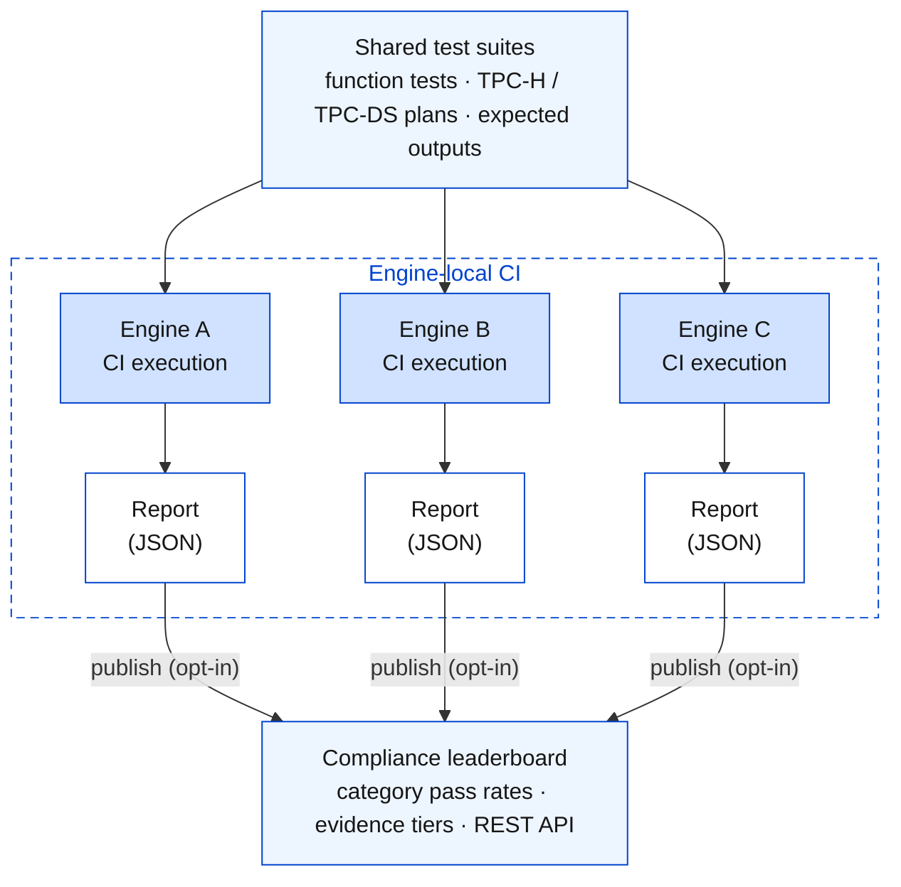
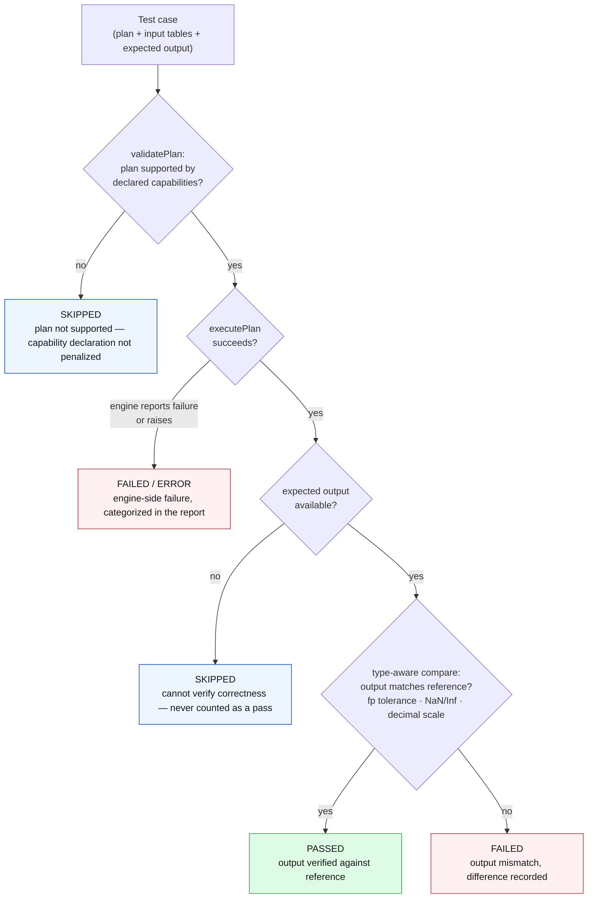

# The Substrait Compliance Framework: A Technical Introduction

This document explains why plan-level interoperability needs verification, how the framework works, how to start using it, and where help is most useful.

---

## 1. The problem: parsing is not executing

[Substrait](https://substrait.io/) is a portable intermediate representation for relational algebra. A dataframe library, a SQL front end, or an automated planner produces a plan once, and any conforming engine can execute it: DuckDB, DataFusion, Velox, and a growing list of others. Teams maintain no custom connectors and no N×M integration matrix.

A standard fixes the syntax of the boundary between components. It does not fix the semantics. An engine can accept a Substrait plan, execute it without error, and return different rows than another conforming engine would. SQL had the same problem for forty years. A shared language never implied shared behavior, because casting rules, null propagation, overflow handling, and function definitions all differ between implementations. Moving the contract from query text to the plan removes most parsing-level ambiguity; the semantic gap remains.

Three routine cases show the failure mode. A plan computes avg(x) over a group that a predicate-pushdown rewrite happens to leave empty; one engine returns NULL, another raises an error. A plan divides two DECIMAL(38,s) columns, and the engines disagree on result scale and rounding mode, which shifts every number downstream. A regexp_count call runs against two regex dialects that count zero-length matches differently. Checking that the plan is structurally valid catches none of this.

Divergence is also getting more expensive. Composable stacks chain producers, rewriters, and engines that were developed independently, so an error introduced at one boundary flows through the pipeline into results nobody inspects row by row. And the component composing the plan is increasingly a program, not a person. A human analyst brings domain knowledge and might question a suspicious number. An automated pipeline has no such check and will propagate a wrong answer at full throughput. If plans cross engine boundaries routinely, semantic equivalence must be verified, not assumed.

## 2. Why decentralized

The usual answer to conformance is a certifying authority that runs a canonical suite against every implementation. That model does not fit this ecosystem.

Engine teams often cannot send proprietary builds, internal traces, or customer data to an outside validator, which rules out any design that requires shipping artifacts to a central lab. Timing is a second obstacle: engines ship continuously, so conformance must run in each team's CI on every commit, not through a periodic certification queue. Disclosure is a third: a compliance failure can reveal implementation details a company does not intend to publish, so teams must be able to participate while keeping diagnostics private. Finally, a binary certified/not-certified result is too coarse for the consumers who need the evidence. A planner deciding where to send a plan cares which categories of operations an engine handles correctly, not whether it cleared an aggregate bar.

The framework therefore inverts the model. The test corpus is shared and versioned. Execution happens inside each engine's own environment. Reporting is federated, and each team decides what it publishes. Compliance verification becomes one more reusable component in the composable stack.

## 3. Architecture

Three layers, mirroring the modular structure of the systems under test.



Shared suites run decentralized: locally, inside each engine's own CI pipeline (the dashed region), with no data leaving the engine team's environment. Structured reports feed a public leaderboard that exposes category pass rates and evidence tiers over a REST API. The figure adapts Figure 1 of the SAO 2026 paper, ending at the leaderboard; section 4 describes downstream consumers of the evidence, such as plan routers.

The first layer is the shared corpus, a versioned and language-neutral set of correctness fixtures. It holds 5,041 function-level assertions across 136 files in 14 categories: arithmetic (with decimal, rounding, and logarithmic subfamilies), string, comparison, datetime, aggregate, array, map, struct, set, window, conditional, JSON, cast, and geospatial. Each function test specifies typed input columns, a plan exercising one function under defined edge conditions such as nulls, boundaries, overflow, and empty groups, and an expected result with an explicit floating-point tolerance. Alongside the function tests sit the benchmark suites: all 22 TPC-H queries and all 99 TPC-DS queries, serialized as Substrait plans in binary and JSON form, each with committed expected outputs. Result correctness is verifiable end to end. None of this measures speed. These are semantic-fidelity tests, and the only question they answer is whether an engine returns the right rows.

An LLM helped construct part of the corpus through a generate-and-gate pipeline. A gap analyzer proposes edge cases that hand-written suites tend to miss (empty groups, all-null columns, cross-type combinations), and an automated validator rejects any candidate that is malformed or whose expected value cannot be justified from the specification. The model proposes; the validator decides. Where the specification is silent, candidates are discarded rather than given an invented answer.

The second layer is engine-local execution. SDKs exist in eight languages: Java, Python, Rust, Go, C++, TypeScript, C#, and Scala. Each exposes an idiomatic form of the same contract, and everything runs in the engine team's own environment and CI. No data leaves it.

The third layer is federated reporting. Results aggregate into a structured compliance report with per-category pass rates, engine version, and declared capabilities, exportable as JSON, Markdown, HTML, or CSV. A team can keep reports private, publish summaries, or submit them to a leaderboard through the included REST API reference implementation. The design separates private diagnostics (the failing inputs and traces, which stay local) from the published summary of per-category results. That separation lets proprietary engines participate.

## 4. The engine contract

Integrating an engine means implementing one interface. The Java SDK defines it as follows, and the other seven languages express the same contract in their own idiom (abstract base classes in Python, traits in Rust, and so on):

```java
public interface ComplianceEngine {
    EngineInfo getEngineInfo();               // name, version, vendor
    EngineCapabilities getCapabilities();     // supported relations, functions, types
    PlanValidationResult validatePlan(Plan plan);
    ComplianceResult executePlan(Plan plan, Map<String, TableData> inputData);
    default void initialize() { }             // once per suite, before any test
    default void cleanup()    { }             // once per suite, after all tests
}
```

Two methods return metadata. The other two do the work: validatePlan checks structural validity, and executePlan runs the plan against the provided input tables and returns tabular results. The framework's comparator verifies those results against the expected output using type-aware equality, which covers floating-point tolerance, NaN and Infinity semantics, and decimal scale handling.

Every test ends in one of four states: PASSED, FAILED, SKIPPED, or ERROR. The distinction matters. An engine that does not implement geospatial functions says so through its capabilities, and the runner records those tests as skipped instead of failed, so declaring capabilities accurately costs nothing. The rule cuts the other way as well. A test whose expected output is unavailable is recorded as SKIPPED, never PASSED. A pass always means the output matched a reference; it never means the plan merely ran without crashing.

The runner classifies each test case through a fixed decision sequence:



Per-category results then roll up into fidelity tiers, one tier per category per engine:

| Tier | Criteria | What a consumer may assume |
|------|----------|----------------------------|
| verified | Full category passes, including overflow and cross-type cases, above threshold | Safe for arbitrary inputs in this category |
| edge | Nominal inputs plus standard edge cases pass: nulls, boundaries, empty groups | Safe for typical workloads; audit overflow-sensitive plans |
| basic | Nominal inputs pass; null, boundary, or overflow cases fail | Safe only if inputs are known to be well-behaved |
| none | Category unsupported, or the engine declares it skips the category | Do not route plans requiring this category here |

Tiers turn raw test states into evidence that downstream tools can consume, and they are the unit the capability contract is written in.

Capability declarations extend into a capability contract. A plan induces a demand: the operators, function signatures, types, and required tier per category that it needs. Each component advertises what it supports and the tier it has measured per category. A conservative static check walks each boundary in a chain of components and either confirms the composition is safe for that plan or names the specific boundary, operator, and observed tier that falls short. Unknown coverage counts as unsafe, never as a guess. Compliance evidence becomes a precondition that planners, dispatchers, and routing components can enforce before execution, not only a reporting artifact. The same corpus supports differential testing across engines: each plan runs on every engine that declares support, and the runner flags any disagreement. Differential testing needs no reference output, and it localizes a fault to a specific boundary. This is an active development direction.

## 5. Getting started

Clone the repository and build the Java SDK, then run the compliance demos. The complete sequence takes about 10–15 minutes on first run.

```bash
# Clone and build
git clone https://github.com/IBM/substrait-compliance.git
cd substrait-compliance
sdk/java/gradlew shadowJar -p sdk/java

# Run TPC-H tests (from demo/ directory)
cd demo
./runner/run-simple-demo.sh          # Quick: 22 TPC-H queries
# ./runner/run-demo.sh               # Enhanced: more detailed output

# Run TPC-DS tests (99 queries, more complex than TPC-H)
# ./runner/run-tpcds-demo.sh

# Run function-level tests (must cd to demo/runner/)
cd runner
./run-function-tests.sh              # Java version: 4,000+ tests, 14 categories
# ./run-function-tests-python.sh     # Python version: 5,000+ tests, 15 categories

# View results
cd ..
python3 -m http.server 8080          # Open http://localhost:8080/dashboard/
```

Results are saved as JSON in `demo/runner/output/`. The dashboard displays pass rates by category and engine, with per-category fidelity tiers (verified, edge, basic, none) and evidence for plan-routing decisions.

To integrate an engine, pick the SDK matching your language under sdk/, implement ComplianceEngine, load a suite through the provided loader, and run it with ComplianceRunner. Working reference integrations live in examples/: a DuckDB integration in Java and C++ that executes plans through DuckDB's native Substrait extension, and a DataFusion integration in Rust and Python built on from_substrait_plan. A status table in that directory documents what each example demonstrates. The Java SDK builds as a self-contained fat jar via ./gradlew shadowJar, and installation instructions for every language are in the main README.

CI integration is a single file. Copy .github/workflows/engine-compliance-template.yml into your engine's repository and set four variables: engine name, version, minimum pass-rate threshold, and the framework version to pin. From then on every commit runs the suite, and the build fails if compliance drops below your threshold. The template checks the framework out at a pinned release tag, so your compliance target stays stable across framework releases.

## 6. What the framework provides

For an engine team, the immediate return is a regression gate for semantic correctness, a class of defect that passes unit tests and shows up later in aggregate results. The per-category report localizes the failure: a datetime edge case, a decimal scale error, a null-propagation path. This feedback loop has already taken one failing TPC-H integration to full compliance, one commit at a time.

Plan producers and platform builders gain a principled basis for a decision that previously had none: whether a given composition of components is semantically safe for a given plan. With category-level evidence and tiers, a dispatcher can route around documented weaknesses instead of discovering them in production.

The Substrait project benefits too. When independent engines disagree on a case and the specification does not define the behavior, regex dialect semantics being a recurring example, nobody has a bug. The failing case is direct evidence for an upstream specification issue, and surfacing those ambiguities strengthens the standard itself, not only its implementations.

## 7. Contributing

The framework's value comes from the engines that run it and the corpus they run against. Contributions expand both.

Running the suite against a production engine is the most valuable contribution. Implement the interface, run the suites, and report how it went. A published compliance report is ideal; an issue describing integration friction or a discussion post is also useful. Real-engine reports are the primary measure of the project's success.

Test cases are welcome at any scale. The expected-output format is a documented, typed CSV (headers like revenue:double; see test-suites/tpch/README.md), and function tests are self-contained fixtures. Edge cases pulled from production bug trackers are especially valuable, because a defect observed in one engine tends to reproduce in others.

Specification ambiguities deserve reports of their own. If a test's expected value looks wrong because the Substrait specification admits more than one reading, open an issue with the case. A disputed semantic is not noise; it is one of the project's intended products.

SDK and example work is open in all eight languages: idiomatic improvements, additional suite loaders and report formats through the existing plugin interfaces (no core changes required), and deeper reference integrations.

Questions and proposals go to [GitHub Discussions](https://github.com/IBM/substrait-compliance/discussions). Issues are triaged, and contribution guidelines are in CONTRIBUTING.md.

## 8. Further reading

Two workshop papers develop the design. "Trust at the Seams: Differential, Decentralized Compliance for Composable Query Engines" (CDMS Workshop at VLDB 2026) covers the composability argument, capability contracts, and differential testing. "Parsing Is Not Executing: Decentralized Compliance for Agentic Query Plan Routing" (SAO Workshop at ACM CAIS 2026) covers evidence-based plan routing. Repository documentation lives under [docs/](../docs), test-suite formats under [test-suites/](../test-suites), and the architecture guide in [SUBSTRAIT_COMPLIANCE_FRAMEWORK_GUIDE.md](SUBSTRAIT_COMPLIANCE_FRAMEWORK_GUIDE.md).

Substrait standardizes the syntax of the plan boundary. Whether two implementations mean the same thing by the same plan is a separate question, and only measurement can answer it. This framework answers it from inside each engine's own CI.
