# REST API Architecture Diagram

## System Architecture Overview

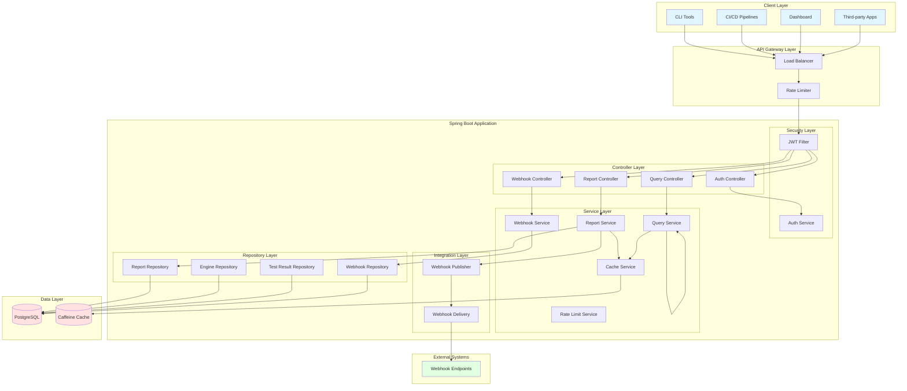

## Request Flow Diagram

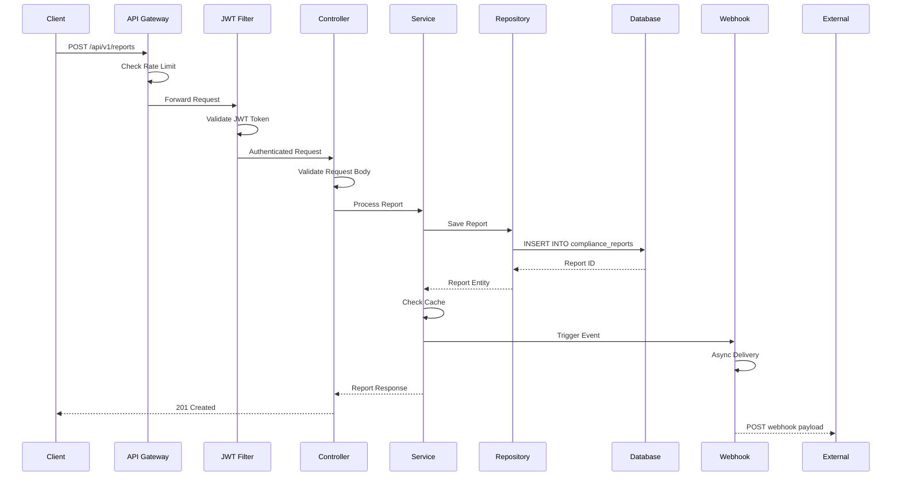

## Database Entity Relationship Diagram

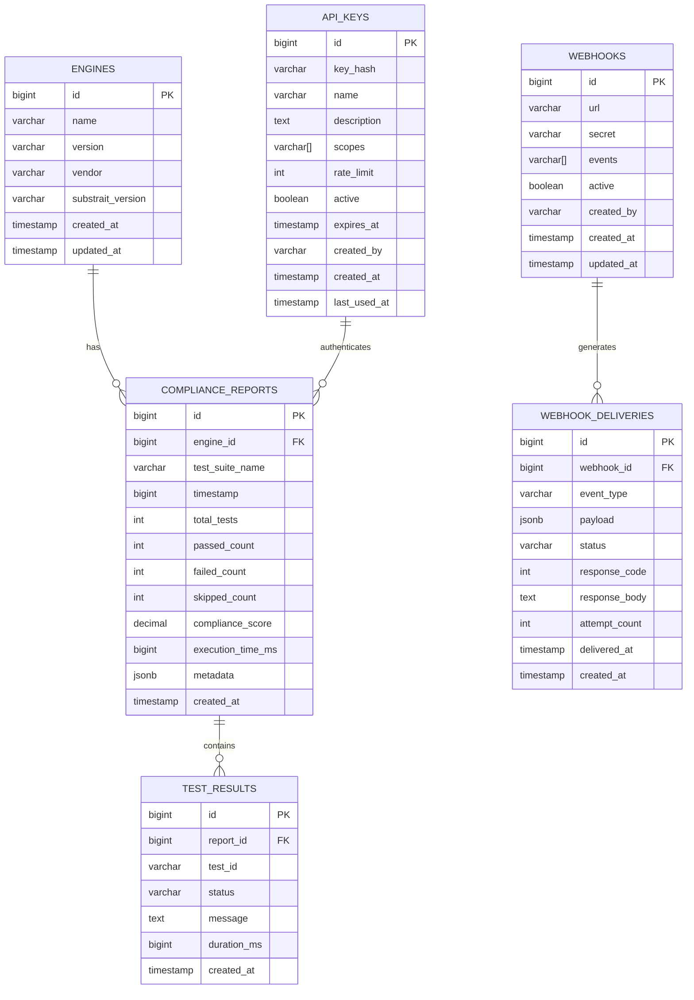

## Component Interaction Diagram

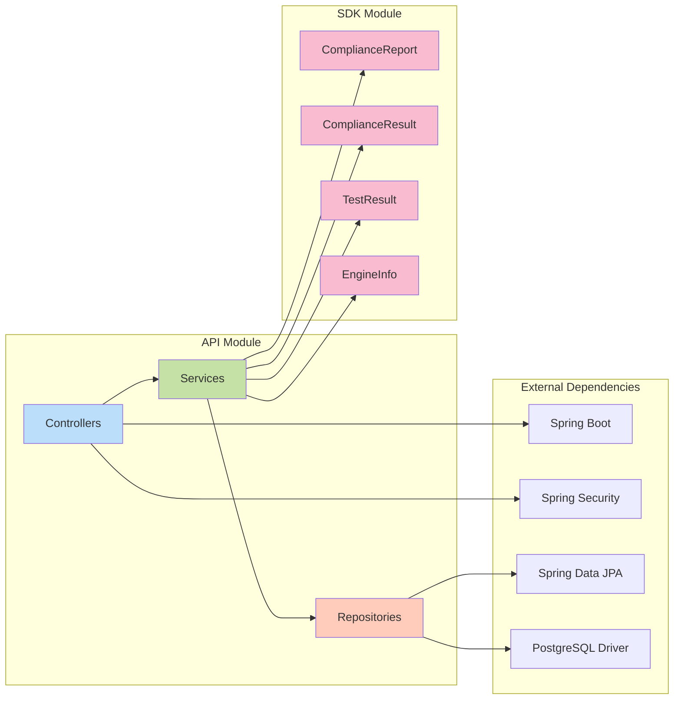

## Deployment Architecture

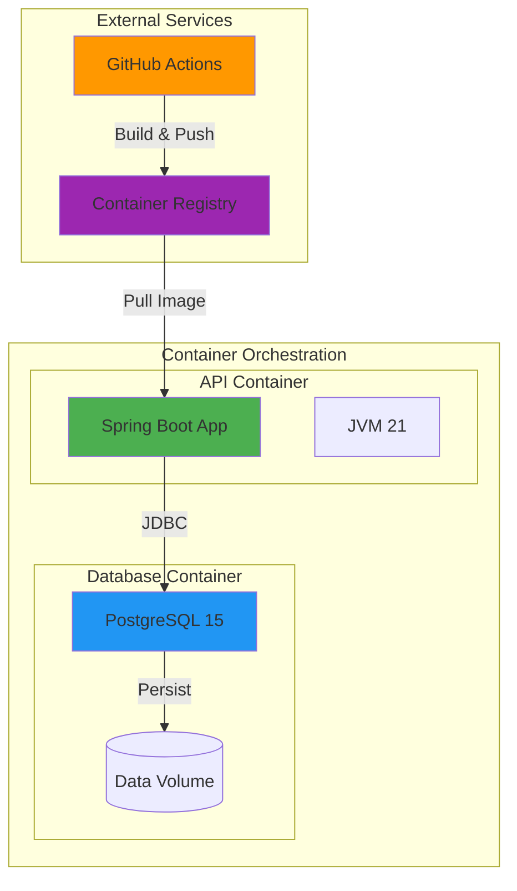

## Security Flow

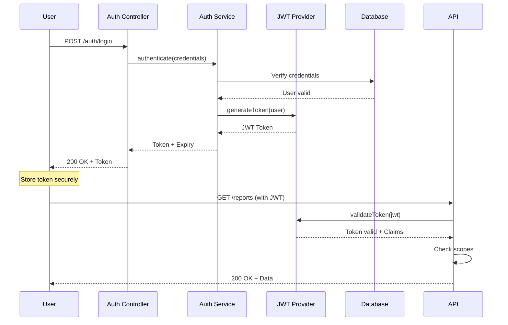

## Caching Strategy

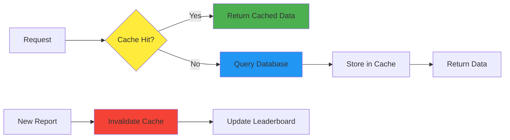

## Webhook Delivery Flow

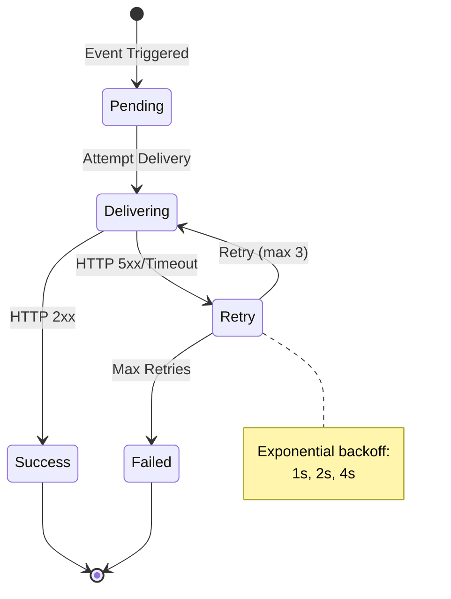

## Rate Limiting Algorithm

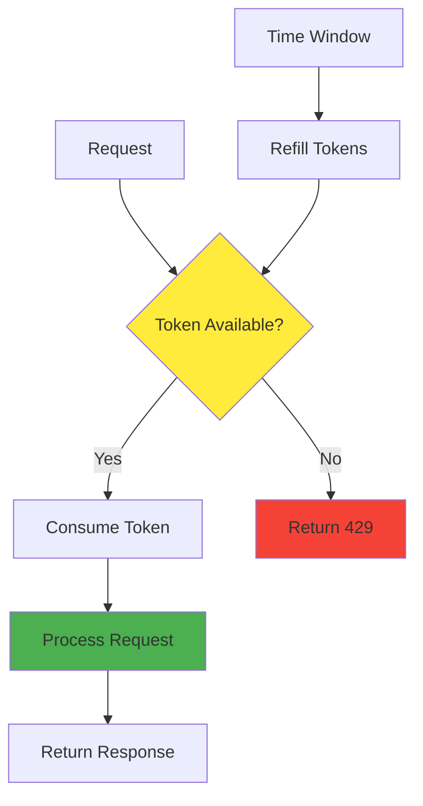

## API Versioning Strategy

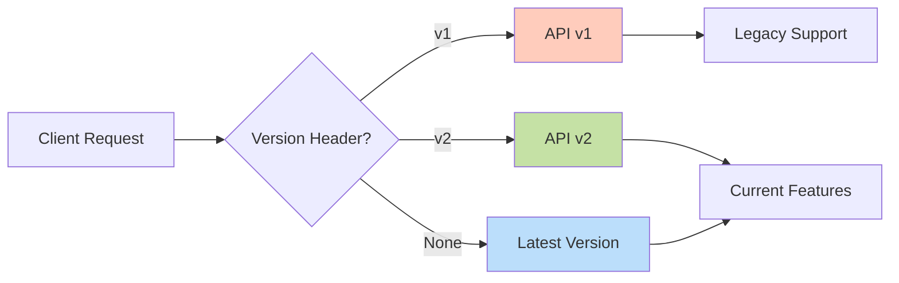

## Monitoring & Observability

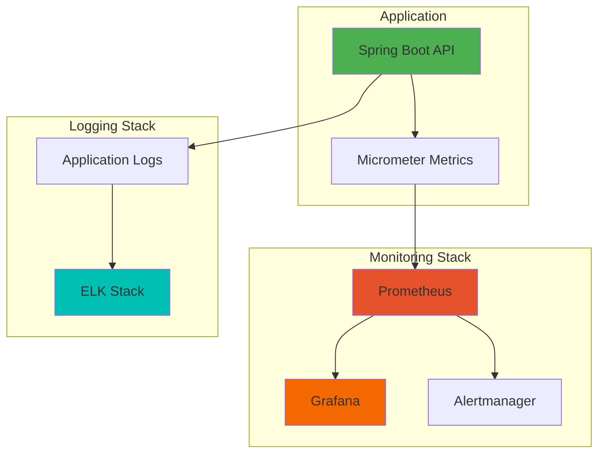

---

**Document Version:** 1.0  
**Last Updated:** 2026-04-16  
**Purpose:** Visual architecture reference for REST API implementation